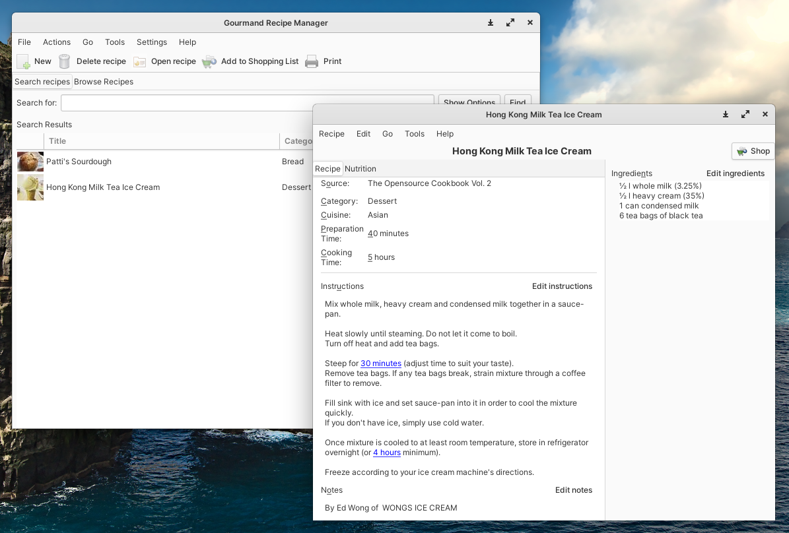

# Gourmand Recipe Manager

 

Gourmand is a fork of the Gourmet Recipe Manager: a manager, editor, and organizer for recipes.  

## Requirements and Installation

Installation instruction are found in the [installation guide](docs/installation.md).

## Issues and Contributions

See the [contribution guide](docs/contributing.md).

## Tournant for Android

If you want to transfer your recipes to your Android device, give [Tournant](https://tournant.zimbelstern.eu) a try. Tournant can parse Gourmand's XML recipe files and serves your recipes wherever you need them – whether in the kitchen or in the grocery store.
